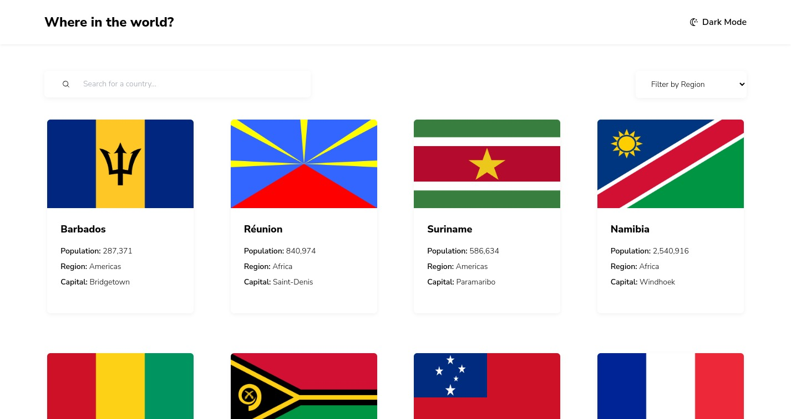

# Frontend Mentor - Rest Country Api

### The challenge

Users should be able to:

- See all countries from the API on the homepage
- Search for a country using an input field
- Filter countries by region
- Click on a country to see more detailed information on a separate page
- Click through to the border countries on the detail page
- Toggle the color scheme between light and dark mode (optional)

### Screenshot

### Links

- Solution URL: [GitHub](https://github.com/manuelbenites/rest-country-api)
- Live Site URL: [Vercel](https://rest-country-api-indol.vercel.app/)

### Built with

- [React](https://reactjs.org/)
- [Vite](https://vitejs.dev/)
- [Tailwindcss](https://tailwindcss.com/)
